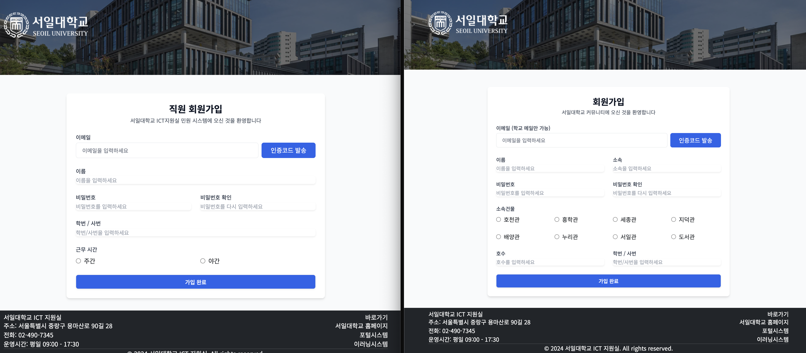
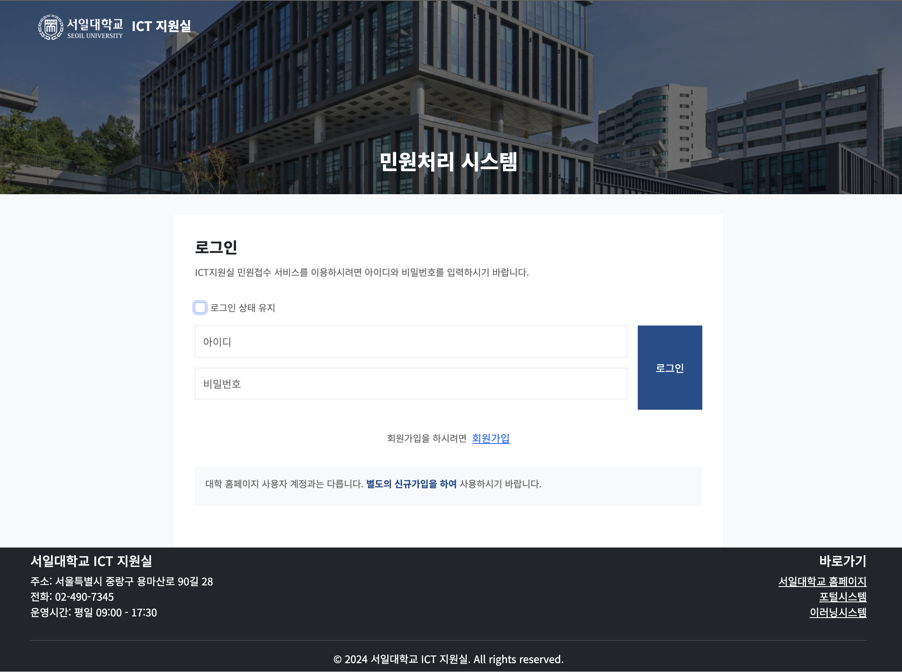
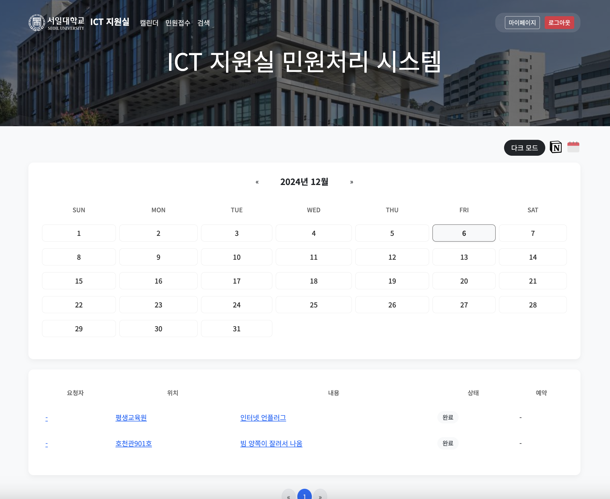
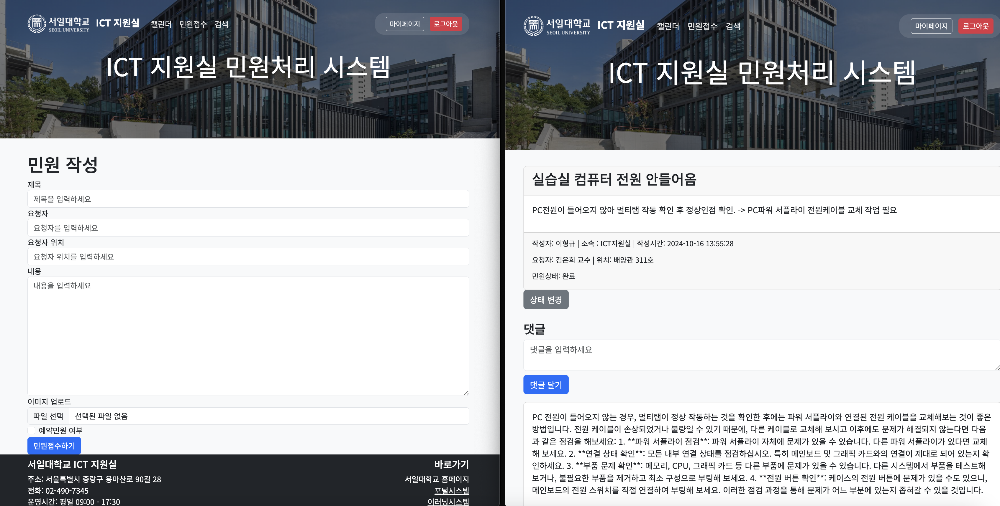
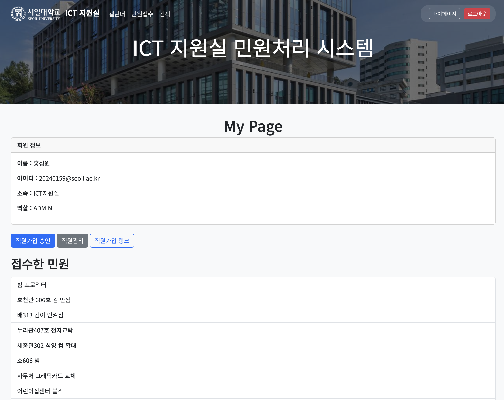
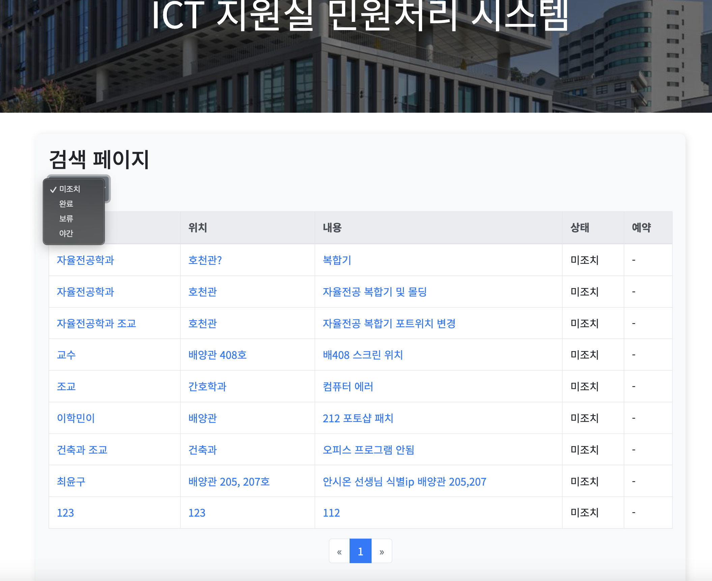

# 🏫 서일대학교 ICT지원실 민원관리 시스템

## 📌 주요 기능
### 1. 이원화된 회원가입 시스템
#### 👨‍💼 직원용
- 관리자 승인 기반 회원가입 프로세스
- 승인 즉시 팀 Slack 초대 메일 자동 발송
- 부서별 권한 관리

#### 👨‍🎓 민원인용
- 학교 이메일 기반 인증 시스템
- 간편한 가입 프로세스
- 실시간 이메일 인증

### 2. 보안 강화 로그인 시스템
- 5회 로그인 실패 시 1시간 계정 잠금
- Remember-Me 기능으로 편리한 로그인 상태 유지
- 세션 기반 보안 관리

### 3. 직원 전용 대시보드
- 날짜별 민원 조회 시스템
  - 10개 단위 페이징 처리
  - 예약/일반 민원 구분 표시
- 실시간 민원 현황 모니터링

### 4. 스마트 민원 관리
#### ✍️ 민원 접수
- 예약/일반 민원 선택 옵션
- 다중 이미지 첨부 기능
- 자동 Slack 알림 시스템
  - Slack 발송 실패시 이메일 백업 발송

#### 📋 민원 처리
- AI 기반 자동 답변 시스템
- 관리자 민원 상태 관리
  - 조치완료
  - 야간이전
  - 보류
- 실시간 처리현황 업데이트

### 5. 마이페이지
- 회원정보 관리
- 본인 접수 민원 및 댓글 이력 조회

### 6. 검색 시스템
- 상태별 민원 필터링

## 💻 기술 스택
<!-- 사용된 기술 스택 아이콘들 추가 예정 -->
| Category | Technologies |
|----------|-------------|
| Backend |     |
| Database |   |
| Cloud |    |
| DevOps |   |
| Frontend |      |
